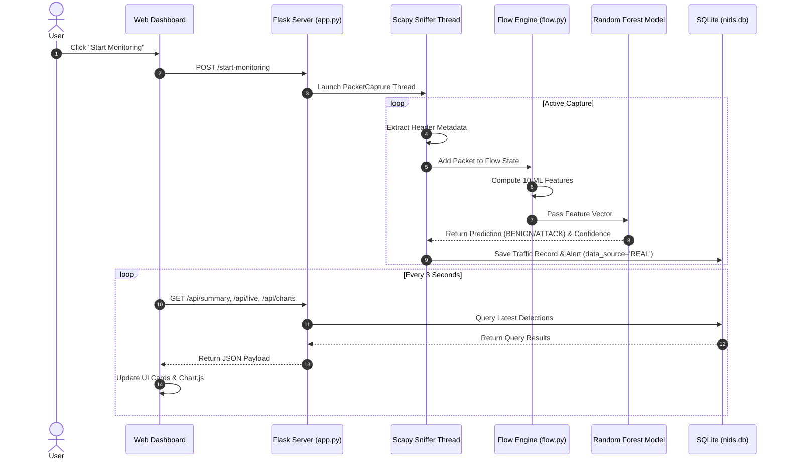

# AI-NIDS System Architecture Document

## 1. Architectural Overview

The **AI-NIDS** system follows a modular, layer-decoupled architecture designed for stateful network traffic inspection and machine learning threat classification.

```text
+-------------------------------------------------------------------+
|                        PRESENTATION LAYER                         |
|  Flask Jinja2 Templates (Dashboard, Live Traffic, Alerts, Model)  |
|  Retro-Futuristic CSS Aesthetics & Dynamic JS Polling / Chart.js  |
+-------------------------------------------------------------------+
                                  ^
                                  | REST API Calls (JSON)
+-------------------------------------------------------------------+
|                           APPLICATION LAYER                       |
|                       Flask Application (app.py)                  |
|          Monitoring Controller Thread & Control Routes            |
+-------------------------------------------------------------------+
               /                                     \
              /                                       \
+---------------------------+           +---------------------------+
|      DATABASE LAYER       |           |     INFERENCE ENGINE      |
|    SQLite (nids.db)       |           |   PredictionService       |
| network_traffic & alerts  |           | Random Forest (.joblib)   |
+---------------------------+           +---------------------------+
              ^                                       ^
              | Persistence                           | Features
+-------------------------------------------------------------------+
|                    NETWORK INSPECTION PIPELINE                    |
|  Scapy Sniffer Thread (packet_capture.py)                        |
|  Packet Header Extractor (features.py)                            |
|  Bidirectional Flow Aggregator (flow.py)                          |
+-------------------------------------------------------------------+
                                  ^
                                  | Raw IP Frames
+-------------------------------------------------------------------+
|                       HARDWARE / SYSTEM LAYER                     |
|            Authorized Network Interface (Wi-Fi / Ethernet)       |
+-------------------------------------------------------------------+
```

---

## 2. Component Breakdown

### 2.1 Packet Capture Component (`network/packet_capture.py`)
- Executes Scapy `sniff()` in a background daemon thread.
- Dissects packet headers into lightweight metadata dicts.
- Includes fallback logic: attempts Layer-2 sniffing first, falls back to Layer-3 IP socket sniffing if WinPcap/Npcap driver is absent.

### 2.2 Flow Aggregation Component (`network/flow.py`)
- Tracks active network conversations.
- Computes bidirectional statistics: forward packets/bytes, backward packets/bytes, duration, and packet rates.

### 2.3 Machine Learning Inference Component (`ml/predict.py`)
- Loads saved `random_forest_model.joblib`, `feature_list.joblib`, and `preprocessing_info.joblib`.
- Validates numeric vector parameters and executes fast inference.

### 2.4 Persistence Layer (`database/db.py`)
- SQLite storage handling parameterized SQL queries.
- Manages auto-migration and tags records with `data_source = 'REAL'` or `data_source = 'DEMO'`.

### 2.5 Web Interface (`templates/`, `static/`)
- Flask HTTP routes serving HTML templates.
- Polling client (`main.js`) updating UI elements every 3 seconds.

---

## 3. Data Flow Sequence Diagram


